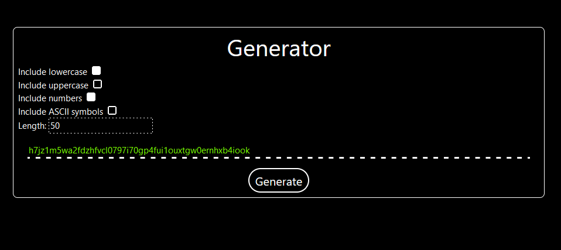
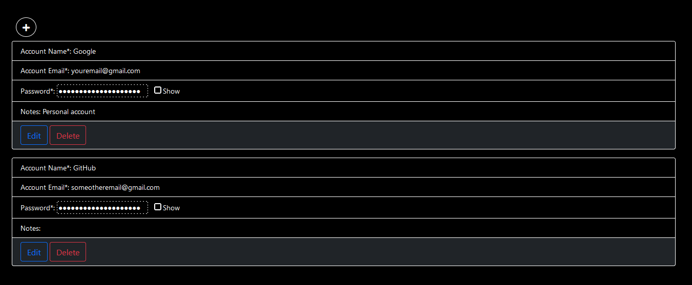

<br/>
<p align="center">
  <a href="https://github.com/fpasqu/password-manager">
    
  </a>

  <h3 align="center">Password Manager</h3>

  <p align="center">
    Stores, encrypts and manages passwords safely
    <br/>
    <br/>
    <a href="https://github.com/fpasqu/password-manager/issues">Report Bug</a>
    .
    <a href="https://github.com/fpasqu/password-manager/issues">Request Feature</a>
  </p>
</p>

   

## Table Of Contents

- [Table Of Contents](#table-of-contents)
- [About The Project](#about-the-project)
- [Built With](#built-with)
- [Prerequisites](#prerequisites)
- [Getting Started](#getting-started)
- [Usage](#usage)
- [License](#license)
- [Authors](#authors)

## About The Project

This ASP.NET webapp will allow you to perform CRUD operations on your passwords. In the background, the program will encrypt and store on a local database, so that the data remains obfuscated if comprimised. 

The webapp also has a "Generator" page, where you can generate new passwords to use for your entries.

## Built With

This project uses the ASP.NET framework, so the backend and the frontend are merged in a single solution. The database that was chosen for this project is SQLite, this was done to facilitate the setup process and keep things lightweight.

## Prerequisites

To run the setup script, you will need to have **Python** installed. You can find the download page [here](https://www.python.org/downloads/).

If you want to work on the source code, it is reccomended to use any of the **Visual Studio** editions. You can find the download page [here](https://visualstudio.microsoft.com/it/downloads/).

At last, the project uses an **Azure directory** to authenticate users.

## Getting Started

Open your Azure directory (now renamed "Azure Entra ID") and navigate to the **App registrations** tab, here you'll need to register a new application.

When running the setup script, you will first need the following information:
1. **Client ID**, **Tenant ID** and **API Audience (Application ID URI)**: Visible in the overview tab of the application;
2. **Callback URL**: You'll need to set this URL for the login/sign-out process. Navigate to the **Authentication** tab and add a Redirect URI. The pattern used should be:

```sh
https://<YOUR CUSTOM DOMAIN>/signin-oidc
```

3. **Group ID**: Navigate to your directory homepage and create a new group. This group will be used to manage who is allowed to use the app. Take note of the **Object ID** and add members to the group.

Once you have all the information, run the Python script and input the required data.

## Usage

If the user is not authenticated, it can still use the **Generator** tab. You'll be able to choose which charset to include and the length:



After authentication, the user will be able to access the **Your passwords** tab, where you can create, read, update and delete entries:



## License

Distributed under the MIT License. See [LICENSE](https://github.com/fpasqu/password-manager/blob/main/LICENSE) for more information.

## Authors

* **Federico Pasquali** - *IT Consultant* - [fpasqu](https://github.com/fpasqu/)
